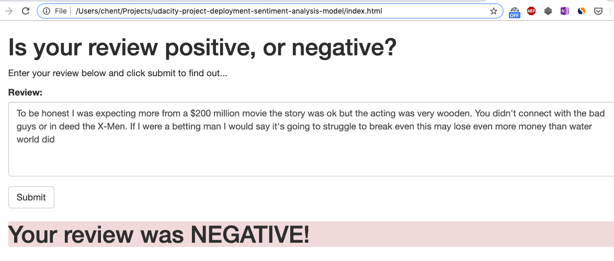
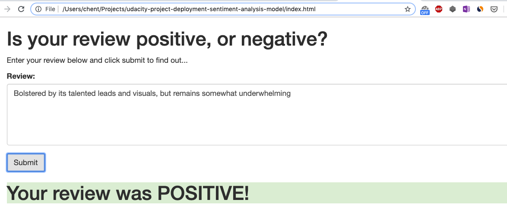

# Sentiment Analysis Model Deployment
a sentiment analysis on IMDB movie reviews. 

# Runtime requirement
The notebooks need Python 3 environment. 

# Project Overview
In this project, I constructed a recurrent neural network (RNN) for the purpose of determining the sentiment of a movie review using the IMDB data set. This model was created and deployed using Amazon's SageMaker service. To deliver the service, a simple web app is constructed for interactiving with deployed model.  

# File Description
- The `SageMaker Project.ipynb` records all steps to achieve this project.  
- `report.pdf` is exported `SageMaker Project.ipynb`.  
- `train/train.py` is about training RNN model.  
- `serve/predict.py` is about how to do a prediction.  
- `website/index.html` is the simple web app.  

# Result 
The trained model achieved 83% accuracy.

# Demo

# License
The content of this repository is licensed under a [MIT license](LICENSE)
